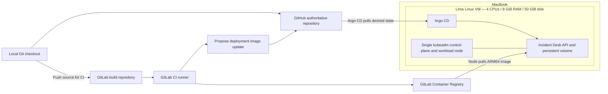

# CKA GitOps Practice Lab

A hands-on Kubernetes administration project for an Apple Silicon MacBook: one Linux VM bootstrapped with **kubeadm**, with **GitLab CI** for image builds and **Argo CD** for GitOps delivery.

## Current status — 10 September 2026

**The lab is running; full application/Argo CD restart recovery and the first troubleshooting exercise are verified.** Initial provisioning was repaired in the existing VM; see [the bootstrap incident](docs/incident-notes/0001-bootstrap.md). Incident Desk is deployed and Argo CD has completed its first manual sync from GitHub. GitLab CI has passed and its digest-pinned image is deployed.

| Component | Status |
| --- | --- |
| Host inspection | Apple Silicon, macOS 26.6.2, 24 GiB RAM, 10 CPU cores |
| Lima | Installed through Homebrew, version 2.2.0 |
| Kubernetes VM | Running after verified restart on 10 September; Ubuntu 26.04 LTS, containerd 2.3.3 |
| Kubernetes | v1.34.11 installed; node Ready, all eight system/network pods Running, API readiness passes |
| Argo CD | v3.5.2 running; all seven pods Ready |
| Example application | Seven API tests pass; deployed; Service DNS, API writes/reads and persistence across pod replacement verified |
| Kubernetes application manifests | Deployment, Service, ConfigMap, PVC and local PV applied successfully |
| GitLab CI | Pipeline #2 passed: tests, ARM64 image build/push, promotion artifacts |
| Argo CD application | Read-only GitHub connection verified; manual sync Succeeded, application Synced / Healthy at promotion commit 761a0f3 |
| Remote repository | Private GitHub repository: https://github.com/HarryDo15/cka-gitops-lab; GitLab CI project: haithanh23.15/cka-gitops-lab; pipeline and registry verified |

The local Git repository is connected to the private GitHub repository [HarryDo15/cka-gitops-lab](https://github.com/HarryDo15/cka-gitops-lab). GitHub holds the project documentation and source; the requested CI service remains GitLab. GitHub is authoritative. The planned GitLab build/promotion flow is documented in [GITLAB.md](docs/GITLAB.md).

## Intended architecture



macOS hosts the Linux VM. Inside it, kubeadm manages a real control plane with etcd and static pods, kubelet, and containerd. The control-plane scheduling taint is removed so the same node can run applications. Lima forwards the Kubernetes API to `127.0.0.1:16443` to avoid the common Docker Desktop port 6443.

The VM has no host filesystem mounts. Application data is intended to live inside its disk at `/var/lib/incident-desk`. Stopping the VM preserves that disk; deleting the VM destroys its local data.

The initial template uses Flannel. **Flannel alone does not enforce Kubernetes NetworkPolicy.** Add a policy-capable CNI or compatible policy engine before attempting network isolation exercises.

## Repository layout

```text
app/                       Python API and container image definition
infra/kubeadm.yaml          Adapted Lima v2.2.0 kubeadm template
scripts/up.sh              Create/start VM and copy isolated kubeconfig
scripts/kubectl.sh         kubectl wrapper using this project's kubeconfig
scripts/install-argocd.sh   Install pinned Argo CD manifests
scripts/connect-gitlab.sh  Connect the GitLab repository to Argo CD
docs/SETUP.md              Installation and remaining integration work
docs/PRACTICE.md           Project ideas and CKA exercises
```

## Start here

Read [the setup guide](docs/SETUP.md) before running commands. Start or resume the cluster with:

```bash
cd /Users/haido/Projects/cka-gitops-lab
bash scripts/up.sh
```

The VM was shut down cleanly on 9 September and resumed successfully on 10 September 2026. It was stopped again after the application and Argo CD milestones, then resumed with all 16 pods Ready and existing incidents intact. All eight system/network pods returned to Running. The local `k` shell alias selects this project’s kubeconfig.

Host access through `127.0.0.1:16443` and `scripts/up.sh` were verified on 9 September 2026. Swap is disabled. Full VM stop/start recovery passed on 10 September 2026.

Inspect the application with `k -n incident-desk get pods,svc,pvc`. To access its API, run `k -n incident-desk port-forward svc/incident-desk 8080:80`, then open `http://localhost:8080/healthz`.

For the complete next-session checklist, see [the session handoff](docs/HANDOFF.md). Argo CD is connected and verified. The [first troubleshooting exercise](docs/FIRST-EXERCISE.md) is complete: Service traffic was broken by a selector mismatch and restored through manual Argo CD sync; resolved incident #3 records the result. GitLab pipeline #2 and digest promotion are verified; see [the delivery checkpoint](docs/incident-notes/0005-gitlab-promotion.md).

For project options and exercises, see [the practice plan](docs/PRACTICE.md).

## References

- [Lima Kubernetes template, v2.2.0](https://github.com/lima-vm/lima/blob/v2.2.0/templates/k8s.yaml) — source of the adapted infrastructure template.
- [Lima virtual machine drivers](https://lima-vm.io/docs/config/vmtype/) — native macOS virtualization.
- [Installing kubeadm](https://kubernetes.io/docs/setup/production-environment/tools/kubeadm/install-kubeadm/).
- [Creating a kubeadm cluster](https://kubernetes.io/docs/setup/production-environment/tools/kubeadm/create-cluster-kubeadm/).
- [GitLab BuildKit integration](https://docs.gitlab.com/ci/docker/using_buildkit/).
- [Argo CD installation](https://argo-cd.readthedocs.io/en/stable/operator-manual/installation/).

Versions here record the choices made during setup, rather than a promise that they are the latest available releases.

## Version-control habit

Group related changes into substantial, verified milestones before committing and pushing. See [the checkpoint guide](docs/VERSION-CONTROL.md).

## First troubleshooting exercise

[Break and repair a Service selector](docs/FIRST-EXERCISE.md), then record its symptom, diagnosis, cause, fix, and verification in Incident Desk. Incidents are entered manually; this app is not a cluster monitoring agent.

## Application backup

Run `python3 scripts/backup-app.py` to save a consistent SQLite snapshot on the Mac and verify an isolated restore through the API. All three incidents passed on 14 September 2026. See [backup and restore instructions](docs/BACKUP.md). Backups remain outside Git.

## Monitoring and logging

Prometheus, Grafana, Alertmanager, Loki and Alloy are deployed under the `monitoring` namespace, with four persistent volumes and two-day telemetry retention. Live metrics and the Incident Desk → Alloy → Loki → Grafana log pipeline passed verification. See [access, configuration and practice checks](docs/OBSERVABILITY.md). Keep this work together as one observability milestone.
